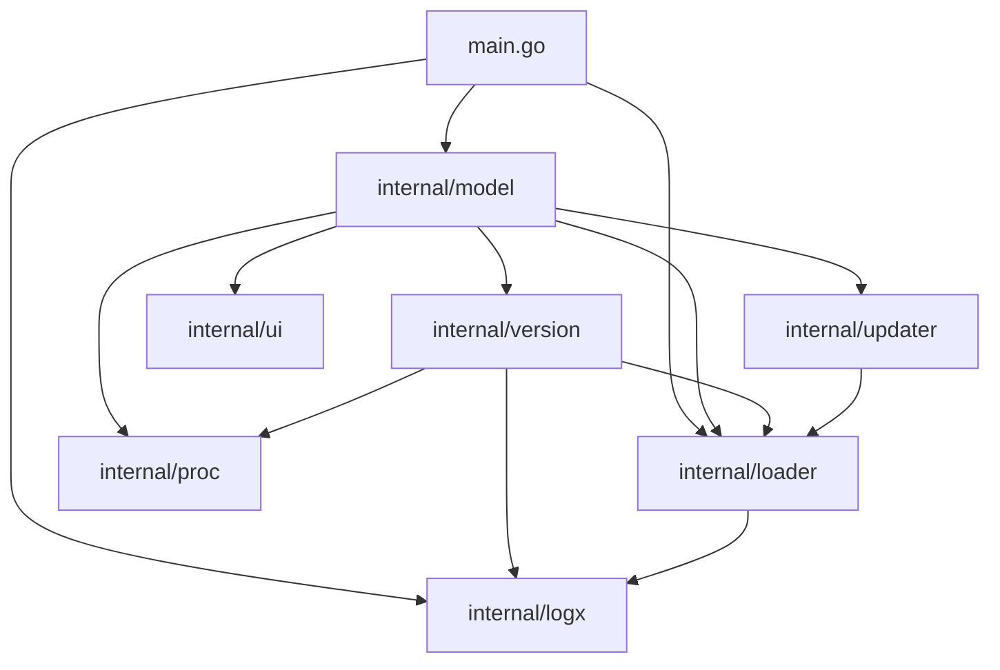

# Architecture

`keeptui` is a terminal TUI tracker for CLI tools built with [Bubble Tea](https://github.com/charmbracelet/bubbletea).
It is a pure TUI: `main.go` is a thin launcher that reads the tracker (`loader.LoadMeta()`),
sets up the error journal (`logx`) and starts the Bubble Tea model (`model.New(meta)`).
The only CLI surface is `--version`/`-V` and `--help`/`-h` (handled in `main.go`
before the TUI starts, so `keeptui` can be probed by version detectors — including
itself); any other argument errors out instead of booting the TUI.

## Package map



| Package | Responsibility |
|---|---|
| `internal/loader` | Tracker persistence (`meta.yaml`), status lifecycle (`active → trying → inactive`, legacy values migrated on read), GitHub ref parsing (`NormalizeRepo`, `ParseToolRef`) |
| `internal/logx` | Session error journal: dependency-free, errors only, one lazily created file per session. Package-level state — any package can log without threading a logger through |
| `internal/model` | The entire Bubble Tea model: TUI state, key handling, rendering |
| `internal/proc` | `DetachTTY` — run probes without a controlling terminal; `KillGroup` — process-group SIGKILL (plain `Kill` on Windows) |
| `internal/ui` | Lip Gloss styles, `PlaceOverlay`, `StripANSI` |
| `internal/updater` | Detect the package manager that owns an installed binary and produce an update `Plan{Manager, Argv, Display}` |
| `internal/version` | Detect the installed version locally; GitHub API with a 24-hour cache; semver comparison (`IsNewer`) |

`logx`, `proc`, `ui`, `updater` and `version` sit at the bottom of the import graph:
they know nothing about the TUI. GitHub ref parsing is owned by `loader` (otherwise a
`version ↔ loader` cycle would appear).

The `model` package is split across files within a single package:

| File | Contents |
|---|---|
| `model.go` | The `Model` struct, message types, `New`/`Init`/`Update`, selection and filtering helpers (`selectMeta`, `setFocus`, `searchMatches`, `filteredMeta`, `indexOfMeta`, `setHelpContent`) |
| `mode.go` | The `inputMode` enum and a handler per input mode |
| `commands.go` | All `tea.Cmd` constructors (fetch commands, update streaming) and re-fetch predicates |
| `render.go` | `View`, panel/card/status-bar/gauge/overlay renderers, mouse handling |
| `textutil.go` | Pure text helpers (`wrapText`, `stripANSI`, `colorizeHelp`, `parseHelpEntries`, …) |
| `browser.go` | Opening URLs per `GOOS` |

## Data flow

1. `loader.LoadMeta()` reads `~/.config/keeptui/meta.yaml` — the single source of
   tracked tools.
2. `model.New(meta)` builds the model; `Init()` fires the async fetches — results
   arrive as messages and are merged into the state.

Each tool has four data sources, split so local detection never waits on the network:

- **installed** — `fetchInstalledCmd`: a local subprocess (`--version`/`-V`), always fired;
- **remote** — `fetchRemoteCmd`: a single network pass via `version.GetRepoData`
  (release + repo card + languages), only when `github` is set;
- **changelog** — `fetchChangelogCmd`;
- **help** — `fetchHelpCmd`: `--help`/`-h`/`help` or `man <name>` depending on the panel mode.

Message handlers merge without clobbering (installed never resets latest and vice
versa). On selection change `autoFetchCmdsForSelected()` fills in what's missing —
the pure predicates `needsInstalled`/`needsRemote` skip what is already cached.

### Probe sandbox

A tracked tool may respond to `--help` by booting its own TUI — that must not shred
the `keeptui` screen. The protection has two layers:

1. every probe goes through `proc.DetachTTY` — its own session, no controlling
   terminal: the child's attempt to open `/dev/tty` gets `ENXIO` instead of toggling
   our terminal;
2. output is sanitized before it can reach a viewport: `ui.StripANSI` (the full
   escape-sequence grammar via `x/ansi.Strip`) + `cleanTerminalOutput` (drops stray
   control characters). A capture carrying the alt-screen signature (`ESC[?1049`,
   `isTUITakeover`) is discarded entirely.

## TUI state machine

Three panels with cycling focus: `[1] Tools` (the list), `[2] Brief` (the card),
`[3] Help` (the `--help`/`man`/update-log view). Focus moves with `→`/`←`, the digits
`1`/`2`/`3`, or a mouse click; everything goes through `setFocus(f)`, which repaints
the tools list — the only viewport whose content depends on focus.

All modal state is a single field `m.mode inputMode` (11 values: `modeNormal`, `modeSearch`,
`modeHelpSearch`, `modeEditNote`, `modeEditTags`, `modeTrack`, `modeConfirmUntrack`, `modeRename`,
`modeAPIStatus`, `modeTokenInput`, `modeConfirmUpdate`). Exactly one mode is active at
a time; `Update()` dispatches via `switch m.mode`, so keys that open other modes
structurally cannot fire inside another mode's input.

Key invariants:

- **A single list projection.** Row order (the "has update" group on top, then
  `meta.yaml` order; during search — the name/tag filter) lives only in
  `searchMatches()`. The renderer, the selection index and the mouse row mapping all
  look through it — desync is impossible. `meta.yaml` on disk is never reordered.
- **The cursor follows the tool, not the row.** An async version merge can regroup
  the list; handlers capture the selected tool's name before the merge and remap the
  index afterwards (`indexOfMeta`).
- **Search is a transaction.** `/` remembers `searchPrevName`; `enter` commits the
  selection (focus moves to the card), `esc` rolls the cursor back to the previous tool.
- **`setHelpContent()` is the single recompute point for the help panel.** Entry
  navigation (`j`/`k`, `parseHelpEntries`, the `applySpotlight` spotlight) is
  recomputed only where the visible text actually changed; style-only repaints never
  reset the cursor.

## Updating a tool (`u`)

`updater.Detect` identifies the manager from the installed binary — the chain is
brew → go → cargo → pipx → npm (order matters: brew before go, so a brew-installed
Go binary is not misrouted to `go install`). `update_cmd` from `meta.yaml` always
wins and runs via `sh -c`. Detection spawns subprocesses, so it runs as a `tea.Cmd`,
never inside `Update()`.

Output streaming uses the "channel + re-subscribe" idiom, with no `*tea.Program`: a
goroutine reads the merged stdout+stderr to EOF (`streamLines`, splitting on `\n`
**and** `\r` — brew/npm progress bars collapse into one updating line), then
`cmd.Wait()`, then a final `updateLine{done, err}` item and `close(ch)` — the order
is mandatory, `Wait` before the pipe is drained is forbidden by `os/exec`.
`waitForChunkCmd` does one receive from the channel and re-creates itself. The log
lives in `[3] Update` (a ~500-line buffer); the 10-minute deadline ends with
`proc.KillGroup` on the process group.

## GitHub API

Without a token — 60 requests/hour per IP, with a token — 5000. A tool with `github`
costs 3 requests. Token: `GITHUB_TOKEN` from the environment always wins over the
`~/.config/keeptui/token` file (`0600`); a token entered in the TUI is validated with a
`/rate_limit` request before being written to disk.

- **`doGH(req)`** — the single auth point: headers, the 5-second client, reading the
  rate-limit headers of every response.
- **The rate-limit snapshot** is updated through `mergeRateObservation`: an
  "optimistic" observation from `/rate_limit` cannot roll back the per-request
  header readings within the same window.
- **`ErrRateLimited`** — a typed error for 403/429 with `X-RateLimit-Remaining: 0`
  from the response's own headers; the card shows "rate limited — press [L]",
  already-loaded data is not erased.
- **The cache** (`cache.json`, 24h TTL): every read-modify-write goes through
  `updateCacheEntry(repo, mutate)` — under a mutex, re-read from disk, merge, write
  back; parallel startup goroutines never clobber each other's repositories. Force
  refresh (`r`) skips only the freshness check, keeping the merge and the guard
  against poisoning the cache with an empty response.

## Storage

| Data | Path |
|---|---|
| Tracker metadata | `~/.config/keeptui/meta.yaml` |
| Version cache (24h TTL) | `~/.config/keeptui/cache.json` |
| GitHub token (`0600`) | `~/.config/keeptui/token` |
| Session error log | `~/.config/keeptui/logs/keeptui-<timestamp>.log` |

`SaveMeta` writes atomically (temp file + `os.Rename` in the same directory) — a
crash mid-write can never truncate `meta.yaml`.

## Error journal (`logx`)

Errors only; the file is created lazily on the first write — a session with no errors
leaves no file, so the presence of a file is itself the signal. The filename carries a
colon-free zero-padded timestamp: lexicographic order equals chronological order,
which is what `Cleanup()` relies on (the 20 most recent are kept). `logx.Recover` is
hooked deeper than Bubble Tea's own recover (inside `Update`, `View` and every
command via `safeCmd`): it records the panic with a stack trace and **re-panics** so
Bubble Tea restores the terminal correctly. The logger's own failures are swallowed
silently.

## Testing

Tests never touch the real config: `loader` has a `testConfigDir` seam, `version` has
`testCacheDir`/`testTokenDir`/`testAPIBase`, `updater` has `testHomeDir`. The
exception is `logx.SetDirForTesting(dir)`, which is exported: `version`/`loader`/`model`
tests must redirect *its* output. The races are real (mutexes in `version`, `logx`),
so tests always run with `-race`:

```bash
go test -race ./...
```
